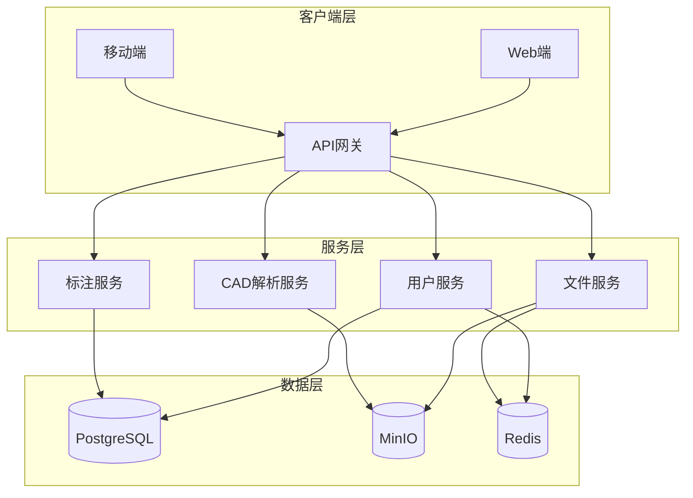

# CAD看图王 Web端与APP 技术架构文档

## 1. 技术选型

### 1.1 前端技术栈

| 分类 | 技术 | 版本 | 选型理由 |
|------|------|------|----------|
| 框架 | React | 18.2.0 | 成熟稳定，生态完善，适合企业级应用 |
| 语言 | TypeScript | 5.0+ | 类型安全，提高代码质量和开发效率 |
| 构建工具 | Vite | 5.0+ | 快速启动，热更新，优化开发体验 |
| UI框架 | Ant Design | 5.0+ | 专业级组件库，设计规范统一 |
| 状态管理 | Redux Toolkit | 2.0+ | 简化Redux使用，内置Immer支持 |
| 路由 | React Router | 6.0+ | 官方路由库，支持React 18 |
| CAD渲染 | OpenLayers | 7.0+ | 强大的地图渲染引擎，支持矢量图形 |
| 图标 | Lucide React | 0.263+ | 轻量级图标库，支持按需加载 |

### 1.2 后端技术栈

| 分类 | 技术 | 版本 | 选型理由 |
|------|------|------|----------|
| 框架 | NestJS | 10.0+ | 企业级Node.js框架，支持TypeScript |
| 语言 | TypeScript | 5.0+ | 与前端保持一致，类型安全 |
| 数据库 | PostgreSQL | 16.0+ | 稳定可靠，支持复杂查询 |
| 缓存 | Redis | 7.0+ | 提升性能，缓存用户会话和文件元数据 |
| 文件存储 | MinIO | 2024+ | 开源对象存储，兼容S3 API |
| ORM | TypeORM | 0.3+ | 支持多种数据库，TypeScript友好 |

### 1.3 移动端技术栈

| 分类 | 技术 | 版本 | 选型理由 |
|------|------|------|----------|
| 框架 | UniApp | 3.0+ | 跨平台开发，一套代码多端运行 |
| 语言 | TypeScript | 5.0+ | 类型安全 |
| UI框架 | uni-ui | 1.4+ | 官方组件库，适配多端 |

---

## 2. 架构设计

### 2.1 系统架构图



### 2.2 模块划分

| 模块 | 功能描述 | 所属服务 |
|------|----------|----------|
| 用户模块 | 注册、登录、权限管理 | 用户服务 |
| 文件模块 | 上传、下载、管理 | 文件服务 |
| CAD解析模块 | DWG/DXF文件解析 | CAD解析服务 |
| 标注模块 | 文字、尺寸、图形标注 | 标注服务 |
| 图层模块 | 图层显示、隐藏、锁定 | CAD解析服务 |

---

## 3. 前端架构

### 3.1 项目结构

```
frontend/
├── src/
│   ├── components/          # 通用组件
│   │   ├── Header.tsx       # 顶部导航
│   │   ├── Sidebar.tsx      # 侧边栏
│   │   ├── Toolbar.tsx      # 工具栏
│   │   └── FileList.tsx     # 文件列表
│   ├── pages/               # 页面组件
│   │   ├── Login.tsx        # 登录页
│   │   ├── Register.tsx     # 注册页
│   │   ├── Dashboard.tsx    # 仪表盘
│   │   └── Viewer.tsx       # 图纸查看器
│   ├── features/            # 功能模块
│   │   ├── viewer/          # 图纸查看
│   │   │   ├── Canvas.tsx   # 画布组件
│   │   │   └── useViewer.ts # 查看器hooks
│   │   ├── measure/         # 测量工具
│   │   │   ├── DistanceTool.tsx
│   │   │   └── AreaTool.tsx
│   │   ├── annotation/      # 标注工具
│   │   │   ├── TextAnnotation.tsx
│   │   │   └── DimensionAnnotation.tsx
│   │   └── layers/          # 图层管理
│   │       └── LayerPanel.tsx
│   ├── store/               # 状态管理
│   │   ├── slices/          # Redux slices
│   │   │   ├── user.ts
│   │   │   ├── files.ts
│   │   │   └── viewer.ts
│   │   └── index.ts         # store配置
│   ├── services/            # API服务
│   │   ├── api.ts           # 基础API配置
│   │   ├── user.ts          # 用户API
│   │   └── files.ts         # 文件API
│   ├── utils/               # 工具函数
│   │   ├── cadParser.ts     # CAD解析工具
│   │   └── helpers.ts       # 通用助手
│   ├── types/               # TypeScript类型
│   │   └── index.ts
│   ├── App.tsx              # 主应用组件
│   ├── main.tsx             # 入口文件
│   └── index.css            # 全局样式
├── public/                  # 静态资源
├── package.json
├── tsconfig.json
├── vite.config.ts
└── .env                     # 环境变量
```

### 3.2 关键组件设计

#### 3.2.1 Canvas组件
| 功能 | 描述 |
|------|------|
| 图纸渲染 | 使用Canvas API绑定OpenLayers渲染CAD图形 |
| 缩放控制 | 支持鼠标滚轮和触摸手势缩放 |
| 平移控制 | 支持拖拽平移 |
| 坐标显示 | 实时显示鼠标位置坐标 |

#### 3.2.2 Toolbar组件
| 功能 | 描述 |
|------|------|
| 工具切换 | 测量、标注、图层等工具切换 |
| 视图控制 | 缩放、平移、旋转控制 |
| 导出打印 | PDF导出、图片导出、打印 |

#### 3.2.3 LayerPanel组件
| 功能 | 描述 |
|------|------|
| 图层列表 | 显示所有图层信息 |
| 图层开关 | 切换图层显示/隐藏 |
| 图层锁定 | 锁定/解锁图层 |
| 图层颜色 | 修改图层显示颜色 |

---

## 4. 后端架构

### 4.1 项目结构

```
backend/
├── src/
│   ├── modules/             # 业务模块
│   │   ├── users/           # 用户模块
│   │   │   ├── users.controller.ts
│   │   │   ├── users.service.ts
│   │   │   ├── users.entity.ts
│   │   │   └── dto/         # 数据传输对象
│   │   ├── files/           # 文件模块
│   │   │   ├── files.controller.ts
│   │   │   ├── files.service.ts
│   │   │   ├── files.entity.ts
│   │   │   └── dto/
│   │   ├── annotations/     # 标注模块
│   │   │   ├── annotations.controller.ts
│   │   │   ├── annotations.service.ts
│   │   │   ├── annotations.entity.ts
│   │   │   └── dto/
│   │   └── cad/             # CAD解析模块
│   │       ├── cad.controller.ts
│   │       └── cad.service.ts
│   ├── common/               # 公共模块
│   │   ├── guards/          # 守卫
│   │   │   └── auth.guard.ts
│   │   ├── interceptors/     # 拦截器
│   │   │   └── logging.interceptor.ts
│   │   └── filters/          # 过滤器
│   │       └── exception.filter.ts
│   ├── config/               # 配置文件
│   │   ├── database.config.ts
│   │   └── storage.config.ts
│   ├── main.ts               # 入口文件
│   └── app.module.ts         # 根模块
├── package.json
├── tsconfig.json
├── nest-cli.json
└── .env                     # 环境变量
```

### 4.2 数据库设计

#### 4.2.1 用户表 (users)

| 字段名 | 类型 | 约束 | 说明 |
|--------|------|------|------|
| id | UUID | PRIMARY KEY | 用户唯一标识 |
| email | VARCHAR(255) | UNIQUE, NOT NULL | 邮箱 |
| phone | VARCHAR(20) | UNIQUE | 手机号 |
| name | VARCHAR(100) | NOT NULL | 用户名 |
| password | VARCHAR(255) | NOT NULL | 加密后的密码 |
| avatar | VARCHAR(500) | | 头像URL |
| createdAt | TIMESTAMP | DEFAULT CURRENT_TIMESTAMP | 创建时间 |
| updatedAt | TIMESTAMP | DEFAULT CURRENT_TIMESTAMP | 更新时间 |

#### 4.2.2 文件表 (files)

| 字段名 | 类型 | 约束 | 说明 |
|--------|------|------|------|
| id | UUID | PRIMARY KEY | 文件唯一标识 |
| userId | UUID | FOREIGN KEY | 所属用户ID |
| name | VARCHAR(255) | NOT NULL | 文件名 |
| type | VARCHAR(50) | NOT NULL | 文件类型(DWG/DXF/DGN) |
| size | BIGINT | NOT NULL | 文件大小(字节) |
| url | VARCHAR(500) | NOT NULL | 文件存储路径 |
| thumbnail | VARCHAR(500) | | 缩略图路径 |
| metadata | JSON | | 文件元数据 |
| createdAt | TIMESTAMP | DEFAULT CURRENT_TIMESTAMP | 创建时间 |

#### 4.2.3 标注表 (annotations)

| 字段名 | 类型 | 约束 | 说明 |
|--------|------|------|------|
| id | UUID | PRIMARY KEY | 标注唯一标识 |
| fileId | UUID | FOREIGN KEY | 所属文件ID |
| type | VARCHAR(50) | NOT NULL | 标注类型(TEXT/DIMENSION/SHAPE) |
| content | TEXT | | 标注内容 |
| position | JSON | NOT NULL | 位置坐标 |
| style | JSON | | 样式配置 |
| createdAt | TIMESTAMP | DEFAULT CURRENT_TIMESTAMP | 创建时间 |

---

## 5. API接口设计

### 5.1 用户接口

| 接口路径 | HTTP方法 | Controller文件 | 功能描述 |
|----------|----------|----------------|----------|
| /api/users/register | POST | users.controller.ts | 用户注册 |
| /api/users/login | POST | users.controller.ts | 用户登录 |
| /api/users/profile | GET | users.controller.ts | 获取用户信息 |
| /api/users/profile | PUT | users.controller.ts | 更新用户信息 |
| /api/users/logout | POST | users.controller.ts | 用户退出 |

#### 5.1.1 POST /api/users/register

**请求体:**
```json
{
  "email": "string",
  "phone": "string",
  "name": "string",
  "password": "string"
}
```

**成功响应 (201):**
```json
{
  "id": "uuid",
  "email": "string",
  "name": "string",
  "createdAt": "datetime"
}
```

#### 5.1.2 POST /api/users/login

**请求体:**
```json
{
  "email": "string",
  "password": "string"
}
```

**成功响应 (200):**
```json
{
  "access_token": "string",
  "user": {
    "id": "uuid",
    "email": "string",
    "name": "string"
  }
}
```

### 5.2 文件接口

| 接口路径 | HTTP方法 | Controller文件 | 功能描述 |
|----------|----------|----------------|----------|
| /api/files | GET | files.controller.ts | 获取文件列表 |
| /api/files | POST | files.controller.ts | 上传文件 |
| /api/files/:id | GET | files.controller.ts | 获取文件详情 |
| /api/files/:id | DELETE | files.controller.ts | 删除文件 |

#### 5.2.1 POST /api/files

**请求体:** `multipart/form-data`
| 字段 | 类型 | 说明 |
|------|------|------|
| file | File | CAD文件 |

**成功响应 (201):**
```json
{
  "id": "uuid",
  "name": "string",
  "type": "string",
  "size": "number",
  "url": "string",
  "thumbnail": "string",
  "createdAt": "datetime"
}
```

### 5.3 标注接口

| 接口路径 | HTTP方法 | Controller文件 | 功能描述 |
|----------|----------|----------------|----------|
| /api/annotations | GET | annotations.controller.ts | 获取标注列表 |
| /api/annotations | POST | annotations.controller.ts | 创建标注 |
| /api/annotations/:id | PUT | annotations.controller.ts | 更新标注 |
| /api/annotations/:id | DELETE | annotations.controller.ts | 删除标注 |

---

## 6. 部署架构

### 6.1 开发环境

```
┌─────────────────────────────────────┐
│           Development               │
├─────────────────────────────────────┤
│  Frontend: localhost:5173          │
│  Backend: localhost:3000           │
│  PostgreSQL: localhost:5432        │
│  Redis: localhost:6379             │
│  MinIO: localhost:9000             │
└─────────────────────────────────────┘
```

### 6.2 生产环境

```
┌─────────────────────────────────────┐
│            Production               │
├──────────────┬──────────────────────┤
│   Frontend   │     Backend          │
│   Vercel     │   Docker + K8s       │
│              │                      │
├──────────────┼──────────────────────┤
│    CDN       │   PostgreSQL         │
│              │   Redis (Cloud)      │
│              │   MinIO (S3)         │
└──────────────┴──────────────────────┘
```

---

## 7. 安全设计

### 7.1 认证与授权
- JWT Token认证
- 密码BCrypt加密存储
- 接口访问权限控制

### 7.2 数据安全
- HTTPS传输加密
- 文件存储加密
- SQL注入防护

### 7.3 防护措施
- 接口限流
- 文件大小限制
- 异常请求拦截

---

**文档版本**: v1.0  
**创建时间**: 2026-05-28  
**作者**: Trae AI Assistant